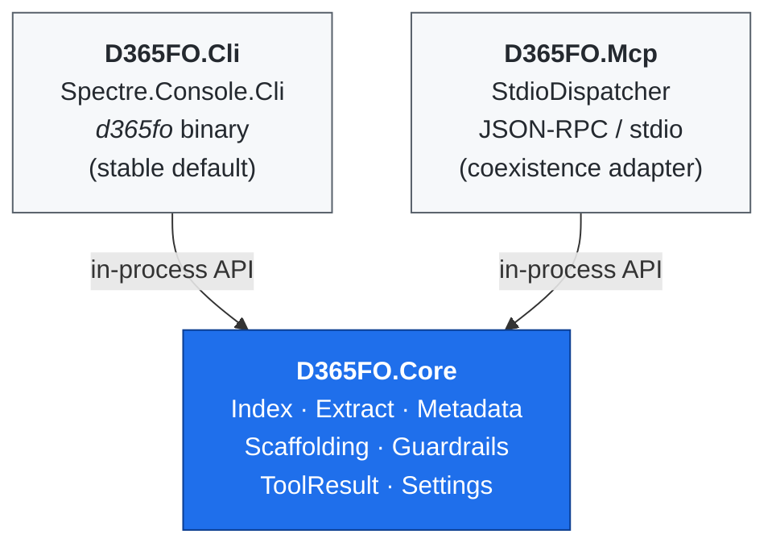

# Architecture

## Three projects, one core



Key invariant: **only `D365FO.Core` knows about D365FO**. Both CLI and MCP
transports are thin adapters. A command handler is never more than "parse
args → call Core → render envelope".

## Output contract

Every tool returns `ToolResult<T>`:

```json
{ "ok": true,  "data": { ... }, "warnings": ["..."] }
{ "ok": false, "error": { "code": "UPPER_SNAKE", "message": "...", "hint": "..." } }
```

JSON is the default on non-TTY stdout. TTY renders Spectre tables. Flag
`--output json|table|raw` overrides.

## Index

SQLite single-file (`$D365FO_INDEX_DB` or `$LOCALAPPDATA/d365fo-cli/d365fo-index.sqlite`).
Schema **v5** in [src/D365FO.Core/Index/Schema.sql](../src/D365FO.Core/Index/Schema.sql)
— the version is tracked in `PRAGMA user_version` and migrations are applied
automatically on first connection via `MetadataRepository.EnsureSchema`.
`MetadataRepository` is stateless — every call opens and closes its own
connection so the same type runs from a short-lived CLI process, a long-lived
MCP server, or a future daemon.

Covered AOT types: Tables (fields, relations, indexes, methods, delete actions),
Classes (methods + attributes), Edts, Enums, Forms (+extensions), MenuItems,
Labels (multi-language), Queries (+datasources), Views (+fields), DataEntities
(+fields + OData names), Reports (+datasets), Services (+operations),
ServiceGroups (+members), WorkflowTypes, SecurityRoles/Duties/Privileges plus a
flattened `SecurityMap`, ObjectExtensions, EventSubscribers, CoC extensions,
and ModelDependencies parsed from each package's `Descriptor/*.xml`.

SQLite booleans are stored as INTEGER; `SqliteBoolHandler` teaches Dapper the
conversion once at static init.

## Extract pipeline

`MetadataExtractor.ExtractAll(packagesRoot)` walks `<root>/<Package>/<Model>/`
and yields one `ExtractBatch` per model. Per-file XML parsing inside a model is
run in `Parallel.ForEach` (degree = `Environment.ProcessorCount`). Label
resources are scanned recursively under `AxLabelFile/LabelResources/<lang>/`
(modern D365 layout; the legacy inline `<AxLabel>` manifest form is also
supported). `*FormAdaptor` companion packages are skipped at both package and
model level via `MetadataExtractor.IsFormAdaptorPackage`, matching the
behavior of the upstream `d365fo-mcp-server`.

`D365FO.Core.Extract.XppSourceReader` extracts the `<SourceCode><Declaration>`
block and per-method `<Source>` CDATA from AOT XML for `d365fo read class|table|form`.

## Guardrails

- `StringSanitizer` strips control characters from free-form metadata
  (labels, descriptions) to defend against prompt-injection embedded in
  customer data. CLI opt-out: `--raw-text`.
- Error envelope is always structured — never leak raw exception text to stdout.
- Write-ops that mutate XML on disk use atomic swap + `.bak` (see the
  `generate` commands and `Scaffolding/ScaffoldFileWriter`).

## Reads vs writes — the C# Metadata Bridge

Reads and writes are routed through a **`D365FO.Bridge` sibling project** —
a .NET Framework 4.8 child process started over stdio JSON-RPC from
`D365FO.Core`. The bridge loads D365FO's own assemblies at runtime and
exposes `IMetadataProvider` + `DiskProvider` operations, so the CLI always
speaks to the same store that Visual Studio and MSBuild use.

**Bootstrap.** `MetadataBootstrap` late-binds
`Microsoft.Dynamics.AX.Metadata.Storage.MetadataProviderFactory.CreateRuntimeProviderWithExtensions`
and resolves `Microsoft.Dynamics.AX.*` assemblies through an
`AppDomain.AssemblyResolve` hook against `D365FO_BIN_PATH` (defaults to
`D365FO_PACKAGES_PATH\bin`). The provider instance is cached and
lock-guarded; a failed bootstrap surfaces `LastError` so the CLI can fall
back to the index.

**JSON-RPC surface** (one request per line, UTF-8):

| Method | Purpose |
| --- | --- |
| `ping` | Liveness + diagnostics (`binPath`, `packagesPath`, `metadataLoaded`, `metadataError`). |
| `shutdown` | Graceful exit. |
| `readClass` / `readTable` / `readEdt` / `readEnum` / `readForm` | Authoritative per-object read. `readEnum` falls back to CLR kernel enums (`NoYes`, `Exists`) via `Microsoft.Dynamics.AX.Xpp.Support.dll` when the disk overlay has no match; the response carries `source:"bridge-kernel"`. |
| `createObject` / `updateObject` / `deleteObject` | Go through the provider collections' `Create`/`Update`/`Delete` with a `ModelSaveInfo` built from the target model manifest. Create/Update accept an optional raw Ax* XML blob round-tripped via `XmlSerializer`. |
| `findReferences` | Parameterised query against `DYNAMICSXREFDB` (`Names` + `[References]` + `Modules`); returns source path / line / column / reference kind. Connection string overridable via `D365FO_XREF_CONNECTIONSTRING`. |
| `getModelFolder` | Resolves `ModelManifest.GetFolderForModel` to the on-disk package folder — used by `generate --install-to` to compose the canonical `<ModelFolder>/Ax<Kind>/<Name>.xml` path. |

**Serialisation.** `AxSerializer` is a reflection-based walker — depth cap 6,
reference-cycle-guarded via `HashSet<object>` with `ReferenceEqualityComparer`,
drops empty arrays, primitives / enums / `DateTime` / `decimal` handled
specifically. Good enough for Copilot-sized prompts; deeper hand-rolled
serialisers can be layered on per kind later.

**CLI integration.**

- `D365FO.Core.Bridge.BridgeClient` spawns the net48 exe and pumps JSON-RPC.
- `BridgeGate` in `D365FO.Cli` gates every call behind `D365FO_BRIDGE_ENABLED=1`.
- `d365fo get class|table|edt|enum|form` is bridge-primary with SQLite
  fallback; the response payload carries `_source:"bridge"` /
  `_source:"bridge-kernel"` so callers can audit which store answered.
- `d365fo generate class|table|coc|simple-list --install-to <Model>` asks
  the bridge for the model folder, then writes the fully scaffolded XML
  atomically (same `.tmp`+move+`.bak` pattern used for `--out`).
- `d365fo find refs <Name> --xref` routes through `findReferences`; output
  is tagged `_source:"xrefdb"`. Without `--xref`, the CLI falls back to a
  parallel regex scan over indexed X++ source — cross-platform, no SQL
  Server required.

**Environment.** `D365FO_PACKAGES_PATH` + `D365FO_BIN_PATH` point at the
live `PackagesLocalDirectory`; `D365FO_BRIDGE_ENABLED=1` opts into
bridge-primary reads; `D365FO_BRIDGE_PATH` overrides the exe location.
The bridge is Windows-only and must ship next to a live VM — non-Windows
developers stay on the SQLite-index path automatically.

## MCP coexistence

`D365FO.Mcp.ToolHandlers` forwards to the same `D365FO.Core` primitives. A
follow-up commit replaces `StdioDispatcher` with the official
`modelcontextprotocol/csharp-sdk`, keeping `ToolHandlers` as the stable
internal surface.

## Why .NET 10

- Single source of truth for D365FO developers (C# is the language of the
  upstream X++ runtime).
- Native single-file publish (`dotnet publish --self-contained`) avoids a
  Node runtime on every dev workstation.
- The TFM is tracked in `Directory.Build.props` and the exact SDK pinned in
  `global.json`.
