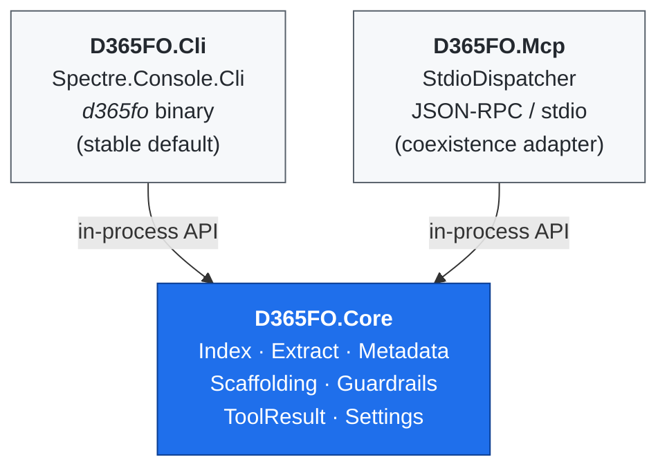

# Architecture

## Three projects, one core



Key invariant: **only `D365FO.Core` knows about D365FO**. Both CLI and MCP
transports are thin adapters. A command handler is never more than "parse
args → call Core → render envelope".

## Output contract

Every tool returns `ToolResult<T>`:

```json
{ "ok": true,  "data": { ... }, "warnings": ["..."] }
{ "ok": false, "error": { "code": "UPPER_SNAKE", "message": "...", "hint": "..." } }
```

JSON is the default on non-TTY stdout. TTY renders Spectre tables. Flag
`--output json|table|raw` overrides.

## Index

SQLite single-file (`$D365FO_INDEX_DB` or `$LOCALAPPDATA/d365fo-cli/d365fo-index.sqlite`).
Schema **v5** in [src/D365FO.Core/Index/Schema.sql](../src/D365FO.Core/Index/Schema.sql)
— the version is tracked in `PRAGMA user_version` and migrations are applied
automatically on first connection via `MetadataRepository.EnsureSchema`.
`MetadataRepository` is stateless — every call opens and closes its own
connection so the same type runs from a short-lived CLI process, a long-lived
MCP server, or a future daemon.

Covered AOT types: Tables (fields, relations, indexes, methods, delete actions),
Classes (methods + attributes), Edts, Enums, Forms (+extensions), MenuItems,
Labels (multi-language), Queries (+datasources), Views (+fields), DataEntities
(+fields + OData names), Reports (+datasets), Services (+operations),
ServiceGroups (+members), WorkflowTypes, SecurityRoles/Duties/Privileges plus a
flattened `SecurityMap`, ObjectExtensions, EventSubscribers, CoC extensions,
and ModelDependencies parsed from each package's `Descriptor/*.xml`.

SQLite booleans are stored as INTEGER; `SqliteBoolHandler` teaches Dapper the
conversion once at static init.

## Extract pipeline

`MetadataExtractor.ExtractAll(packagesRoot)` walks `<root>/<Package>/<Model>/`
and yields one `ExtractBatch` per model. Per-file XML parsing inside a model is
run in `Parallel.ForEach` (degree = `Environment.ProcessorCount`). Label
resources are scanned recursively under `AxLabelFile/LabelResources/<lang>/`
(modern D365 layout; the legacy inline `<AxLabel>` manifest form is also
supported). `*FormAdaptor` companion packages are skipped at both package and
model level via `MetadataExtractor.IsFormAdaptorPackage`, matching the
behavior of the upstream `d365fo-mcp-server`.

`D365FO.Core.Extract.XppSourceReader` extracts the `<SourceCode><Declaration>`
block and per-method `<Source>` CDATA from AOT XML for `d365fo read class|table|form`.

## Guardrails

- `StringSanitizer` strips control characters from free-form metadata
  (labels, descriptions) to defend against prompt-injection embedded in
  customer data. CLI opt-out: `--raw-text`.
- Error envelope is always structured — never leak raw exception text to stdout.
- Write-ops that mutate XML on disk use atomic swap + `.bak` (see the
  `generate` commands and `Scaffolding/ScaffoldFileWriter`).

## MCP coexistence

`D365FO.Mcp.ToolHandlers` forwards to the same `D365FO.Core` primitives. A
follow-up commit replaces `StdioDispatcher` with the official
`modelcontextprotocol/csharp-sdk`, keeping `ToolHandlers` as the stable
internal surface.

## Why .NET 10

- Single source of truth for D365FO developers (C# is the language of the
  upstream X++ runtime).
- Native single-file publish (`dotnet publish --self-contained`) avoids a
  Node runtime on every dev workstation.
- The TFM is tracked in `Directory.Build.props` and the exact SDK pinned in
  `global.json`.
