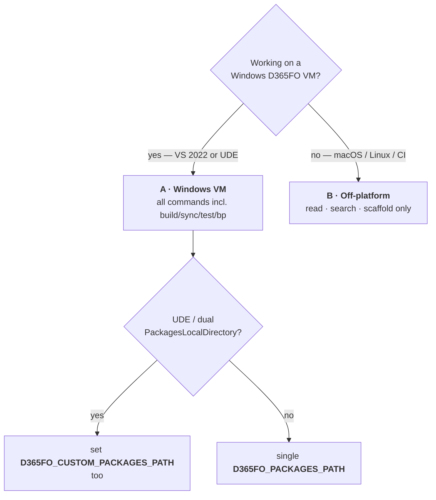
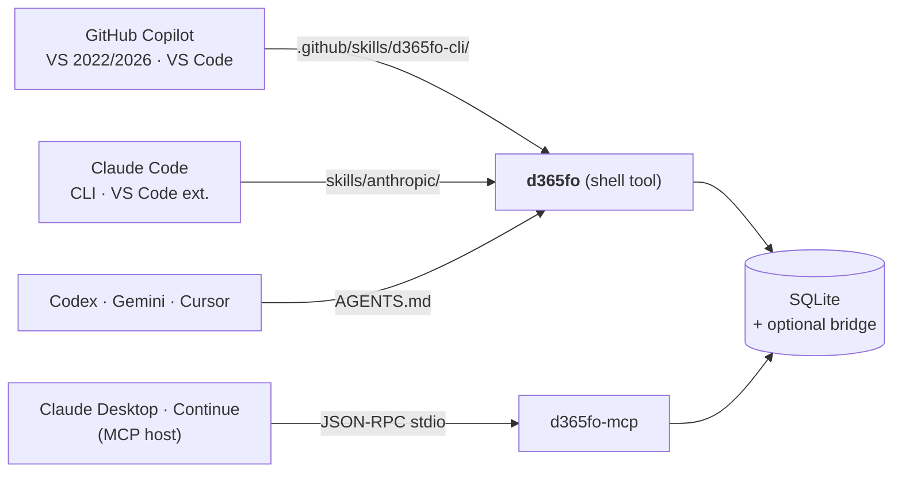

# Setup

Five steps from a fresh clone to a working index that any AI agent can query — or one line that does steps 1–3 for you.

> **TL;DR** — `irm .../install.ps1 | iex` (installs .NET, builds, runs `d365fo init`) · `d365fo index extract` · point your AI agent at it. Done.
> Day-to-day commands: [EXAMPLES.md](EXAMPLES.md) · env vars: [CONFIGURATION.md](CONFIGURATION.md) · architecture: [ARCHITECTURE.md](ARCHITECTURE.md).

## One-line install

```powershell
irm https://raw.githubusercontent.com/dynamics365ninja/d365fo-cli/main/install.ps1 | iex
```

```sh
# macOS / Linux
curl -fsSL https://raw.githubusercontent.com/dynamics365ninja/d365fo-cli/main/install.sh | bash
```

Checks for the .NET SDK (installs it if missing, no elevation needed), clones or updates the repo, publishes a self-contained `d365fo` binary onto `PATH`, and hands off to the `d365fo init` wizard, then `d365fo doctor`. Safe to re-run. Env vars instead of flags, since the script is piped through `iex`/`bash`:

| Variable | Effect |
|---|---|
| `D365FO_CLI_DIR` | Where to clone / look for an existing checkout (default `K:\d365fo-cli` or `~/d365fo-cli`) |
| `D365FO_CLI_YES=1` | Non-interactive: pass `--no-wizard` to `d365fo init` instead of prompting |
| `D365FO_CLI_NO_WIZARD=1` | Install only, skip `d365fo init` entirely |
| `D365FO_CLI_RUN_EXTRACT=1` | Also run `index build` + `index extract` during install (can take minutes for `ApplicationSuite`) |

What's left after either installer: **Step 4** below to populate the index (unless `D365FO_CLI_RUN_EXTRACT` was set), then **Step 5** to connect your AI agent. The steps below are what the installer automates — read them if you want to run each one yourself, understand what happened, or install on a machine you don't want to pipe a remote script into.

---

## Choosing your install path



| Scenario | Index | Read / search / scaffold | `build` / `sync` / `test` / `bp` | Bridge writes |
|---|:---:|:---:|:---:|:---:|
| **A** · Windows D365FO VM | ✅ local SQLite | ✅ | ✅ | ✅ |
| **A-UDE** · UDE dual roots | ✅ local SQLite | ✅ | ✅ | ✅ |
| **B** · Off-platform (mac/Linux/CI) | ✅ local SQLite (extracted from a network share or imported) | ✅ | ❌ `UNSUPPORTED_PLATFORM` | ❌ |

---

## Step 1 — Prerequisites

| Component | Version | Needed for |
|---|---|---|
| .NET SDK | **10** (pinned in `global.json`) | building / running the CLI |
| `git` | any | `d365fo review diff` |
| Visual Studio 2022 / 2026 + Dynamics 365 F&O workload | latest | scenario A — `MSBuild.exe`, `SyncEngine.exe`, `SysTestRunner.exe`, `xppbp.exe` on `PATH` |
| GitHub Copilot extension | latest | VS agent mode (optional) |
| .NET Framework 4.8 Developer Pack | 4.8 | bridge (`D365FO_BRIDGE_ENABLED=1`) — pre-installed on D365FO VMs |

> Off-platform setups (B) only need .NET 10 + git. Everything else is gated by `UNSUPPORTED_PLATFORM` and never invoked.

---

## Step 2 — Install

### Option 1 — Dev mode (alias, fastest)

```sh
git clone https://github.com/dynamics365ninja/d365fo-cli.git
cd d365fo-cli
dotnet build d365fo-cli.slnx -c Release
```

Alias once, never rebuild manually again:

```sh
# bash / zsh — ~/.zshrc or ~/.bashrc
alias d365fo='dotnet run --project /path/to/d365fo-cli/src/D365FO.Cli --'
```

```powershell
# PowerShell — $PROFILE
function d365fo { dotnet run --project C:\path\to\d365fo-cli\src\D365FO.Cli -- @args }
```

### Option 2 — Self-contained binary (CI, shared VMs)

```sh
# Windows
dotnet publish src/D365FO.Cli -c Release -r win-x64 --self-contained `
  -p:PublishSingleFile=true -p:PublishTrimmed=true

# macOS / Linux
dotnet publish src/D365FO.Cli -c Release -r osx-arm64 --self-contained \
  -p:PublishSingleFile=true -p:PublishTrimmed=true
```

Supported RIDs: `win-x64`, `linux-x64`, `osx-x64`, `osx-arm64`. Output lands in `src/D365FO.Cli/bin/Release/net10.0/<rid>/publish/`. Rename to `d365fo` (`d365fo.exe` on Windows) and put it on `PATH`. Drop `--self-contained` if .NET 10 is already installed — output shrinks from ~70 MB to a few MB.

---

## Step 3 — Configure (one command)

Run it bare in a terminal and it's a wizard — confirms the detected packages path (or asks for one), an optional UDE extra root, label languages, and whether to build the index now, then writes everything:

```powershell
d365fo init
```

Or skip the prompts with explicit flags (what the wizard itself ends up writing) — this is also what runs unattended in CI/scripts, since piped/non-TTY output never shows prompts regardless of flags:

```powershell
d365fo init --packages K:\AosService\PackagesLocalDirectory --persist-profile
```

Either way, `init` writes both the JSON config (`%LOCALAPPDATA%\d365fo-cli\settings.json`) **and** every `$PROFILE` it finds (Windows PowerShell 5.1, PowerShell 7, VS Developer PowerShell). Subsequent shells inherit the settings automatically; you never have to remember which `$PROFILE` you edited. Add `--no-wizard` to force the flag-driven path even in a terminal.

**UDE / dual packages roots:**

```powershell
d365fo init `
  --packages       K:\AosService\PackagesLocalDirectory `
  --extra-packages C:\LocalMetadata\PackagesLocalDirectory `
  --persist-profile
```

`--extra-packages` is repeatable. Missing extra roots are silently skipped (the primary root still errors if absent). Multiple extra roots can also be supplied as one semicolon-separated `D365FO_CUSTOM_PACKAGES_PATH` value.

> **Manual override** — bypass `init` and set env vars yourself if you prefer. The minimum is `D365FO_PACKAGES_PATH`; see [CONFIGURATION.md](CONFIGURATION.md) for the full list. Env vars always win over the JSON config.

### Visual Studio Developer PowerShell pitfall

VS Developer PowerShell is **Windows PowerShell 5.1** (`powershell.exe`), which reads a different `$PROFILE` than PowerShell 7 (`pwsh.exe`):

| Shell host | Profile path |
|---|---|
| Windows PowerShell 5.1 / VS Developer PowerShell | `%USERPROFILE%\Documents\WindowsPowerShell\Microsoft.PowerShell_profile.ps1` |
| PowerShell 7+ (`pwsh`) | `%USERPROFILE%\Documents\PowerShell\Microsoft.PowerShell_profile.ps1` |

`d365fo init --persist-profile` writes to **both** profile files plus the JSON config, so the same settings apply everywhere. If you still see disagreements between hosts, the JSON config is authoritative.

---

## Step 4 — Build the index

```sh
d365fo index build      # create / migrate the SQLite schema
d365fo index extract    # ingest metadata from PACKAGES_PATH (idempotent)
d365fo doctor           # confirm everything is green
```

`index extract` is idempotent (re-runs replace rows per model). Scope it to save time:

```sh
d365fo index extract --model MyCustomModel       # seconds
d365fo index extract --model ApplicationSuite    # minutes — parallelised per file
```

| When to refresh | Command |
|---|---|
| You edited XML in a custom model | `d365fo index refresh --model <Model>` |
| New PU / hotfix metadata landed | `d365fo index extract` (re-runs only changed models) |
| `git pull` brought a new schema | `d365fo index build` (in-place migration) |
| Results look stale or wrong | `d365fo doctor` → `d365fo index status` |

Or run the daemon and forget about it — `d365fo daemon start` keeps the SQLite handle hot and auto-refreshes on `*.xml` changes (3 s debounce, disable with `--no-watch`).

---

## Step 5 — Connect your AI agent



### GitHub Copilot — Visual Studio 2022 / 2026 / VS Code (agent mode)

1. Place `d365fo` on `PATH` (either Option 1 alias or Option 2 binary above).
2. Deploy the `d365fo-cli` Copilot skill into a parent folder of your X++ solutions:

   ```powershell
   .\scripts\Install-D365FoCopilotSkills.ps1 `
     -CliRepo C:\source\d365fo-cli `
     -XppRepo K:\D365FO\MyProject
   ```

   The script deploys `skills/d365fo-cli/SKILL.md` and all `references/*.md` to `.github/skills/d365fo-cli/`. One copy in a common parent covers every solution beneath it — VS searches upward from the `.sln`. Copilot auto-discovers skills in `.github/skills/` with no extra configuration.
3. **Agent mode (recommended).** Open Copilot Chat → mode dropdown (top-right) → **Agent**. Copilot now calls `d365fo` directly via its terminal tool — no copy-paste.
4. **Chat mode (fallback).** Without agent tools, Copilot asks you to run `d365fo` commands in Developer PowerShell and paste the JSON back. The skill teaches Copilot to ask first — if it skips that step the `.github/skills/d365fo-cli/SKILL.md` file is missing from the parent folder.

> **How the skill decides to activate — and what to do when it doesn't.**
>
> The skill replaces what used to be 19 separate `.github/instructions/*.instructions.md` files, each scoped by an `applyTo` glob. Those applied deterministically: edit a file matching the glob, get the instructions. A skill works differently — the agent sees only its `name` and `description` and decides for itself whether the task is relevant. That's what makes it cheap (see [TOKEN_ECONOMICS.md](TOKEN_ECONOMICS.md)), but it also means activation is a judgement call, not a rule.
>
> In practice it fires reliably on D365FO work, because the `description` enumerates the artifact types. If it doesn't, name it in your prompt — *"use the d365fo-cli skill"* — or reference the topic file directly, e.g. *"follow references/coc-extension-authoring"*. Visual Studio shows which skills were applied in the chat reply; VS Code lists them under **References**.
>
> If you need the old deterministic behaviour, `skills/copilot/*.instructions.md` is still emitted — copy it to `.github/instructions/` as before. The two layouts coexist; the skill does not clobber them.

> ⚠️ **Never** use `@workspace` or built-in code search on AOT XML. It always fails. Copilot must use `d365fo` exclusively for codebase queries; the Skills enforce this.

> ⚠️ **"Workspace" means two unrelated things here — don't conflate them.**
>
> | Term | What it controls | Set via |
> |---|---|---|
> | `D365FO_WORKSPACE_PATH` (CLI env var) | Where `d365fo generate` writes scaffolded X++ files | `d365fo init` / `settings.json` / env var |
> | Editor "workspace" (VS solution root / VS Code opened folder) | Where Copilot looks for `.github/skills/d365fo-cli/SKILL.md` | Which folder/`.sln` you open in the IDE |
>
> Setting `D365FO_WORKSPACE_PATH` (or any `D365FO_*` env var) has **zero effect** on Copilot's skill discovery. If Copilot isn't finding your skill, the fix is always about **which folder is open in the editor**, never about CLI configuration — re-run `Install-D365FoCopilotSkills.ps1` against the actual parent folder you open, not against `D365FO_WORKSPACE_PATH`.

### Claude Code (CLI or VS Code extension)

```powershell
.\scripts\Install-D365FoClaudeSkills.ps1 -XppRepo "K:\D365FO\MyProject"
```

The Anthropic-format sibling of `Install-D365FoCopilotSkills.ps1`: it installs one
`.claude/skills/<topic>/SKILL.md` per knowledge topic, regenerating them first if the
emitted folder is empty, and prunes topics that were renamed or retired upstream. Both
scripts emit from the same `skills/_source`, so the two ecosystems cannot disagree about
a rule.

Manual equivalent, if you would rather not run the script:

```sh
python3 scripts/emit-skills.py                            # emits skills/anthropic/*/SKILL.md
cp -r skills/anthropic/. /your-repo/.claude/skills/
```

Anthropic SKILL.md files load on demand — Claude reads the YAML frontmatter first and only pulls the full instruction when relevant.

### Codex · Gemini · Cursor · any agent with a shell

Reference the `skills/anthropic/*/SKILL.md` files from your session prompt or `AGENTS.md`. The body of each skill teaches the agent which `d365fo` commands to run for that task.

### MCP hosts (Claude Desktop, Continue, VS Code MCP)

```json
{
  "mcpServers": {
    "d365fo": {
      "command": "d365fo-mcp",
      "args": [],
      "env": { "D365FO_PACKAGES_PATH": "K:\\AosService\\PackagesLocalDirectory" }
    }
  }
}
```

`d365fo-mcp` is the bundled JSON-RPC 2.0 adapter that exposes 20 consolidated, discriminator-based tools backed by the same SQLite index and bridge. Useful for hosts without a shell tool — see [ARCHITECTURE.md#mcp-coexistence](ARCHITECTURE.md#mcp-coexistence).

### Verify

Open the AI chat and ask:

```
What tables contain "CustAccount" field?
```

A `d365fo search` call returning results from your codebase = you are connected.

---

## Step 6 — Scaffold your first object

```sh
# New table
d365fo generate table FmVehicle \
  --label "@Fleet:Vehicle" \
  --field VIN:VinEdt:mandatory \
  --field Make:Name \
  --field Year:YearEdt \
  --out src/MyModel/AxTable/FmVehicle.xml

# Chain-of-Command extension
d365fo generate coc SalesTable --method insert --out src/MyModel/AxClass/SalesTable_MyExt.xml

# Form — consult the pattern spec, scaffold, and the write is pattern-gated
d365fo form-pattern spec SimpleList --output json
d365fo generate form FmVehicles \
  --pattern SimpleList \
  --table FmVehicle \
  --field VIN --field Make --field Year \
  --out src/MyModel/AxForm/FmVehicles.xml

# Form datasource / control override methods (mutates the existing AxForm)
d365fo generate datasource-method FmVehicles --datasource FmVehicle --list      # show overridable methods
d365fo generate datasource-method FmVehicles --datasource FmVehicle --method active
d365fo generate control-method    FmVehicles --control VIN --method modified

# Replace an existing method's body on a live class/table/edt/form (Windows VM, D365FO_BRIDGE_ENABLED=1)
d365fo modify method class CustBalance calc --body "return 2;"
```

One example per `generate` sub-command (25 more object types, security, reports, workflows, …): **[EXAMPLES.md § Scaffold](EXAMPLES.md#scaffold)**.

---

## Quickstart scripts

The [one-line install](#one-line-install) at the top of this page **is** the quickstart script — `install.ps1` / `install.sh` in the repo root do exactly steps 1–3 (build, publish onto `PATH`, `d365fo init`) and then run `doctor`. Set `D365FO_CLI_RUN_EXTRACT=1` first if you also want step 4 done for you. Reading the steps above is only needed if you want to run them by hand instead.

---

## Troubleshooting

| Symptom | Fix |
|---|---|
| `PACKAGES_PATH_NOT_FOUND` | `d365fo init --packages <PATH> --persist-profile`, or set `D365FO_PACKAGES_PATH` manually |
| `UNSUPPORTED_PLATFORM` | `build` / `sync` / `test` / `bp` require Windows + a D365FO dev VM. Everything else still works |
| `NO_INDEX` | `d365fo index build && d365fo index extract` |
| `stale-index` warning from `doctor` | `d365fo index refresh --model <Model>` (or just start the daemon) |
| Copilot Chat says "There was an error executing code search" then writes generic X++ | VS Copilot Chat cannot search AOT XML — the `d365fo-cli` skill must be deployed in a parent folder. Re-run `Install-D365FoCopilotSkills.ps1` and restart VS. For full automation switch Copilot Chat to **Agent** mode |
| Index file appears locked | Stop any running `d365fo daemon` or `d365fo-mcp` process; `-wal` / `-shm` sidecar files are normal |
| Settings differ between Developer PowerShell and PowerShell 7 | Re-run `d365fo init --persist-profile` — it writes both profiles and the JSON config |
| Self-contained binary won't start on Linux | `chmod +x d365fo` after copying out of the publish folder |
| Label values contain control characters | `search label` / `get label` strip them by default — pass `--raw-text` for the unfiltered value |

Full failure-mode catalogue: [TROUBLESHOOTING.md](TROUBLESHOOTING.md).

---

## What's next

| Topic | Documentation |
|---|---|
| One worked example per command | [EXAMPLES.md](EXAMPLES.md) |
| Every env var and config option | [CONFIGURATION.md](CONFIGURATION.md) |
| Index schema, guardrails, bridge, daemon | [ARCHITECTURE.md](ARCHITECTURE.md) |
| Why CLI + Skills beats MCP on token cost | [TOKEN_ECONOMICS.md](TOKEN_ECONOMICS.md) |
| Moving off `d365fo-mcp-server` | [MIGRATION_FROM_MCP.md](MIGRATION_FROM_MCP.md) |
| Tool decision matrix (when to use `d365fo` vs built-in editor tools) | [CAPABILITIES.md](CAPABILITIES.md) |
