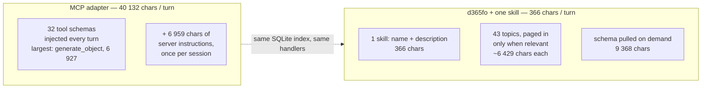

# Token Economics

> **TL;DR** — measured on this repository, not estimated: the bundled MCP adapter puts
> **40 132 characters** of tool schemas into the agent's context **every turn** (32 tools). The CLI's
> one-skill layout puts **366**. Everything else — the command manifest, a knowledge topic — is
> pulled only when the agent asks for it.

Re-measure any time with:

```sh
python scripts/measure-context-cost.py          # table
python scripts/measure-context-cost.py --json   # the same numbers as JSON
```

Every figure below comes from that script, which reads the adapter's own `tools/list` and the
repository's skill files. **Characters are measured; tokens are not.** The exact token count
depends on the model's tokenizer, which this repository has no honest way to measure — where a
token figure appears it is `chars ÷ 3.6` (a reasonable rate for schema-shaped JSON) and is marked
approximate. The ratios, which are what the decision turns on, do not depend on the divisor.

---

## What each integration costs

| | Chars | ≈ tokens | Paid |
|---|---:|---:|---|
| **MCP tool schemas** (32 tools) | 40 132 | ~11 100 | **every turn** |
| MCP server instructions | 6 959 | ~1 900 | once per session |
| **CLI skill, one-skill layout** | 366 | ~100 | **every turn** |
| CLI skills, per-topic layout (43 skills) | 15 055 | ~4 200 | **every turn** |
| `d365fo schema` (36 agent-first commands) | 9 368 | ~2 600 | when the agent asks |
| `d365fo schema --full` (188 commands) | 46 913 | ~13 000 | when the agent asks |
| One knowledge topic (median of 43) | 6 429 | ~1 800 | when the topic comes up |

The shell tool itself is the host's, not this repository's: its description is whatever the agent
platform ships, and it is there whether or not `d365fo` is installed. What the CLI adds on top of
it is the skill row above.

Two layouts, two very different standing costs. `skills/d365fo-cli/` is **one** skill whose
`SKILL.md` names 43 reference topics and pages each in on demand — 366 characters standing.
`skills/anthropic/` is **43** skills, each with its own trigger description, all of them listed to
the model every turn — 15 055 characters standing. Both are emitted from the same
`skills/_source/` topics; pick by whether the host supports lazy references.

---

## Where the tokens go



There is no "load on demand" for MCP tool definitions: a host injects the full `tools/list` schema
set into the model's context on every request, which is why the per-turn figure is the whole
40 132 characters and not an average of what the turn used. The CLI's cost is the skill's trigger
line; the agent runs `d365fo schema` (or `--help`) when it needs the surface, and reads a topic
when the topic is actually on the table.

---

## Over a session

Ten turns, one schema pull and two knowledge topics — a realistic shape for "add a field to a
standard table and wire it into a form":

| | Chars in context | ≈ tokens |
|---|---:|---:|
| MCP adapter | 401 320 + 6 959 | ~113 400 |
| CLI, one-skill layout | 3 660 + 9 368 + 12 858 | ~7 200 |
| CLI, per-topic layout | 150 550 + 9 368 | ~44 400 |

| Turns | MCP | CLI (one skill) | Saving |
|---:|---:|---:|---:|
| 5 | 207 619 | 24 056 | **88 %** |
| 10 | 408 279 | 25 886 | **94 %** |
| 15 | 608 939 | 27 716 | **95 %** |
| 20 | 809 599 | 29 546 | **96 %** |

The saving grows with session length because the MCP cost is per turn and the CLI's on-demand
pulls are per session. It is a floor, not a ceiling: it counts only what is injected, and not the
discovery round-trips that one-call aggregators (`prepare change`, `get batch`, `search batch`)
remove from the transcript entirely.

---

## What this replaced

The previous version of this document estimated **~1 800 tokens/turn** for the MCP surface and
described the adapter as exposing **20 tools**. Measured, the adapter exposes **32** and its
schemas are **~11 100 tokens/turn** — six times the estimate. The estimate was not unreasonable
when it was written (it was reasoning about upstream's consolidation ratio rather than about this
adapter), which is precisely the argument for measuring: a number nobody can re-derive drifts
without anybody noticing, and the direction of the drift is not predictable.

The correction does not change the recommendation. It makes the gap larger.

---

## When the CLI does **not** save

| Situation | Recommended |
|---|---|
| AI host without a shell tool (Claude.ai web, ChatGPT web) | MCP — the bundled `d365fo-mcp` adapter speaks JSON-RPC over the same index |
| A single lookup per session | Either — a warm MCP connection has no per-turn startup cost, and one turn pays the schema once |
| The agent needs generated XML back in context | Neither helps: `d365fo generate` always writes to `--out` and returns a JSON summary |

> **Running both side by side?** Registering the MCP server pays the full per-turn schema cost on
> *every* turn, including the ones that only run the CLI — per-call savings cannot offset a
> per-turn cost. Worth it only for mixed shell-tool environments or a migration grace period. See
> [MIGRATION_FROM_MCP.md](MIGRATION_FROM_MCP.md#when-to-run-both-side-by-side).

---

## Reproducing the measurement

```sh
dotnet build src/D365FO.Cli src/D365FO.Mcp -c Release
python scripts/measure-context-cost.py
```

The script asks the adapter for its tool list over the `--legacy` stdio dispatcher (the same
`ToolCatalog` the SDK transport serves), minifies it, and counts. It reads the skill frontmatter
for the standing cost and calls `d365fo schema` for the on-demand figures. Numbers here were taken
on 2026-09-02; they move whenever a tool or a command is added, which is the point.

---

## Sources

- Anthropic — [Equipping agents for the real world with Agent Skills](https://www.anthropic.com/engineering/equipping-agents-for-the-real-world-with-agent-skills), October 2025.
- Simon Willison — [Claude Skills are awesome, maybe a bigger deal than MCP](https://simonwillison.net/2025/Oct/16/claude-skills/), October 2025.
- seangalliher — [D365-erp-cli, "Why CLI over MCP?"](https://github.com/seangalliher/D365-erp-cli#why-cli-over-mcp).

---

## See also

- [MCP_TOOLS.md](MCP_TOOLS.md) — the 32 tools, and the commands behind each.
- [EXAMPLES.md](EXAMPLES.md#agent-integration) — wiring Skills and the CLI into each AI agent.
- [ARCHITECTURE.md](ARCHITECTURE.md) — the Metadata Bridge and where `d365fo-mcp` plugs in.
- [MIGRATION_FROM_MCP.md](MIGRATION_FROM_MCP.md) — decision tree for MCP users.
